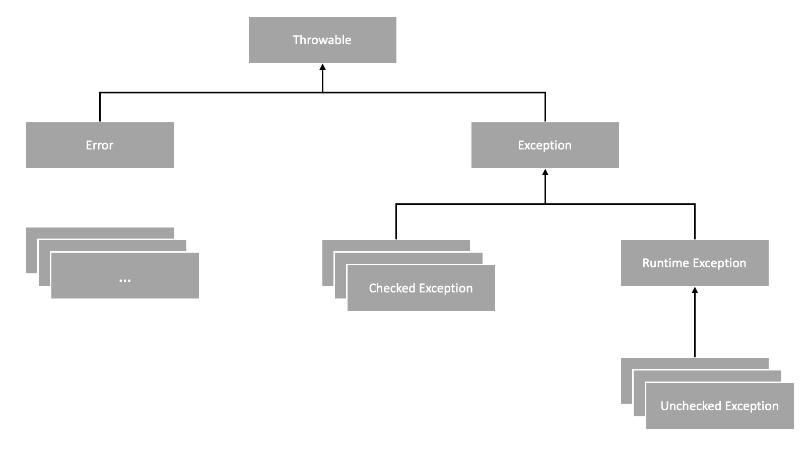

# Item 70. 복구할 수 있는 상황에는 검사 예외를, 프로그래밍 오류에는 런타임 예외를 사용하라

### 문제 상황을 알리는 타입

Java에서는 문제 상황을 알리는 타입(throwable)으로 error, checked exception, unchecked exception(runtime exception)로 세 가지를 제공하고 있다.



<br/>

### Error

-   Error는 시스템 혹은 하드웨어의 오작동으로 인해 발생한다.
-   Error의 종류로는 대표적으로 OutOfMemoryError, StackOverFlowError 등으로 하드웨어 등의 기반 시스템의 문제로 발생한다.
-   이러한 수준의 Error는 심각한 수준의 오류이기 때문에 개발자는 이것을 미리 예측하여 방지할 수 없다.

<br/>

### 호출하는 쪽에서 복구하리라 여겨지는 상황이라면 `검사 예외(Checked Exceptions)`를 사용하라

-   반드시 처리해야 하는 예외이다.
-   컴파일 단계에서 확인이 가능하다.
-   RuntimeException 및 RuntimeException의 하위 클래스들을 제외한 나머지 예외가 이예 해당한다.
-   IOException 등이 Checked Exception에 해당한다.

**예시)**

```java
public class BankAccount {
    private double balance;

    public BankAccount(double initialBalance) {
        this.balance = initialBalance;
    }

    /**
     * Withdraws the given amount from the account.
     *
     * @param amount The amount to withdraw
     * @throws InsufficientFundsException if the account does not have enough
     *                                    balance
     */
    public void withdraw(double amount) throws InsufficientFundsException {
        if (amount > balance) {
            throw new InsufficientFundsException("Insufficient funds. You have only: " + balance);
        }
        balance -= amount;
    }

    public double getBalance() {
        return balance;
    }

    public static void main(String[] args) {
        BankAccount account = new BankAccount(100.0);

        try {
            account.withdraw(150.0);
        } catch (InsufficientFundsException e) {
            System.out.println(e.getMessage());
            // Here, the caller can recover, maybe by prompting the user for a different
            // amount
        }
    }
}

class InsufficientFundsException extends Exception {
    public InsufficientFundsException(String message) {
        super(message);
    }
}
```

```bash
java 70_CheckedException.java
Insufficient funds. You have only: 100.0
```

-   호출하는 쪽에서 복구하리라 여겨지는 상황이라면 검사 예외 사용
-   검사 예외를 던지면 호출자가 그 예외를 catch로 잡아 처리하거나 더 바깥으로 전파하도록 강제할 수 있음
-   검사 예외를 던지는 메서드는 모두 정상적으로 수행되어 호출된다고 가정
-   검사 예외를 던지는 메서드는 반드시 그 상태를 변경하지 않는다고 가정
-   검사 예외를 던지는 메서드는 호출된다면 그 예외를 정확히 문서화해야 함
-   검사 예외를 던지는 메서드는 스레드의 안전성을 보장하지 않는다고 가정
-   검사 예외를 던지는 메서드는 성능이 일반적으로 느리다고 가정
-   검사 예외를 던지는 메서드는 API를 더 어렵게 만든다고 가정
-   검사 예외를 던지는 메서드는 스트림 안에서 직접 사용할 수 없다고 가정
-   검사 예외를 던지는 메서드는 Optional을 반환할 수 없다고 가정
-   검사 예외를 던지는 메서드는 메서드 참조를 사용할 수 없다고 가정
-   검사 예외를 던지는 메서드는 람다를 사용할 수 없다고 가정
-   검사 예외를 던지는 메서드는 반복을 사용할 수 없다고 가정
-   ...

<br/>

### 프로그래밍 오류를 나타낼 때는 `런타임 예외(Runtime Exceptions)`를 사용하라

-   예외 처리를 하지 않아도 된다.
-   런타임 단계에서 확인이 가능하다.
-   RuntimeException의 하위 클래스들이 이에 해당한다.
-   대표적으로 IllegalArgumentException, NullPointerException 등 이 이에 해당한다.

**예시)**

```java
public class UserAgeValidator {
    private int age;

    public UserAgeValidator(int age) {
        setAge(age);
    }

    /**
     * Sets the age, ensuring that it is a valid positive number.
     *
     * @param age Age of the user
     * @throws IllegalArgumentException if the provided age is not a positive number
     */
    public void setAge(int age) {
        if (age <= 0) {
            throw new IllegalArgumentException("Age must be a positive number.");
        }
        this.age = age;
    }

    public int getAge() {
        return age;
    }

    public static void main(String[] args) {
        try {
            UserAgeValidator validator = new UserAgeValidator(-5);
        } catch (IllegalArgumentException e) {
            System.out.println(e.getMessage());
        }
    }
}
```

```bash
java 70-2_RuntimeException.java
Age must be a positive number.
```

-   위의 코드를 실행하면, 나이가 음수로 설정되어 있기 때문에 IllegalArgumentException이 발생합니다.
-   이 예외 유형은 런타임 예외입니다.
-   이것은 프로그래밍 오류 또는 잘못된 인수를 나타내기 때문에, 메서드 시그니처에 throws 절로 선언할 필요가 없습니다.

<br/>

### Checked Exception이 적절한 상황

-   호출한 쪽에서 복구하리라 여겨지는 상황이라면 Checked Exception을 사용한다.
-   이것이 Checked Exception과 Unchecked Exception을 구분하는 가장 기본적인 규칙으로 활용된다.
-   Checked Exception는 기본적으로 호출한 쪽에서 해당 예외를 catch하거나 더 바깥으로 예외를 전파하여 반드시 해결해야 한다.

-   하지만 일반적으로 Checked Exception 예외가 발생했을 경우 복구 전략을 활용하여 복구할 수 있는 경우는 많지 않다.
-   만약 유니크해야 하는 이메일 값이 중복되어 SQLException이 발생했다고 가정한다.
-   유저가 입력 했던 이메일 + 난수를 입력하여 유니크한 상태를 만들고 insert하면 처리가 가능하지만 이것은 적절한 복구 방법이 아니다.
-   결국 catch 이후 Unchecked Exception을 발생 시켜 예외를 다시 전파하는 것이 현실적인 해결 방법이다.

-   결국 사용자에게 예외 상황을 회복하거나 추가적인 예외를 던져 전파할 것을 강제한다.
-   사용자는 예외를 catch하고 아무 행위를 하지 않아도 괜찮지만 권장하지 않는다.
-   자세한 내용은 _아이템 77: 예외를 무시하지 말라_ 에 언급되어 있다.
-   정리하면 Checked Exception의 사용은 결국 고민해야할 사항만 늘어나게 된다.

<br/>

### Unchecked Exception이 적절한 상황

-   프로그래밍 오류를 나타낼 때는 Unchecked Exception을 사용해야 한다.
-   Unchecked Exception은 대부분 전제조건을 만족하지 못했을 때 발생한다.

**전제조건 위배**

-   사용자가 해당 API의 명세에 기록된 제약을 지키지 못했다는 의미이다.
-   한 예시로 ArrayIndexOutOfBoundsException의 경우 잘못된 배열의 인덱스에 접근하는 경우 발생하게 된다.

<br/>

-   하지만 이러한 Unchecked Exception은 복구할 수 있는 상황인지 프로그래밍 오류로 인한 상황인지 명확하게 구별할 수 없다.
-   보통 이것은 API의 설계자의 판단이지만 확신하기 어렵다면 Unchecked Exception을 사용하는 편이 낫다.
-   자세한 내용은 _아이템 71: 필요 없는 검사 예외 사용은 피하라_ 에 언급되어 있다.

<br/>

### 정리

-   복구할 수 있는 상황이면 Checked Exception, 프로그래밍 오류라면 Unchecked Exception을 던지는 것이 바람직하다.
-   만약 확신이 없다면 Unchecked Exception을 던진다. Checked Exception은 결국 예외 처리를 위한 고민만 늘어날 뿐이다.

-   또한 새로운 throwable을 정의하지 말고 Java에서 제공하는 Checked Exception, Unchecked Execption을 적절히 활용한다.
-   만약 Checked Exception을 활용할 경우 복구에 필요한 정보를 알려주는 메서드도 함께 제공하는 것이 바람직하다.
